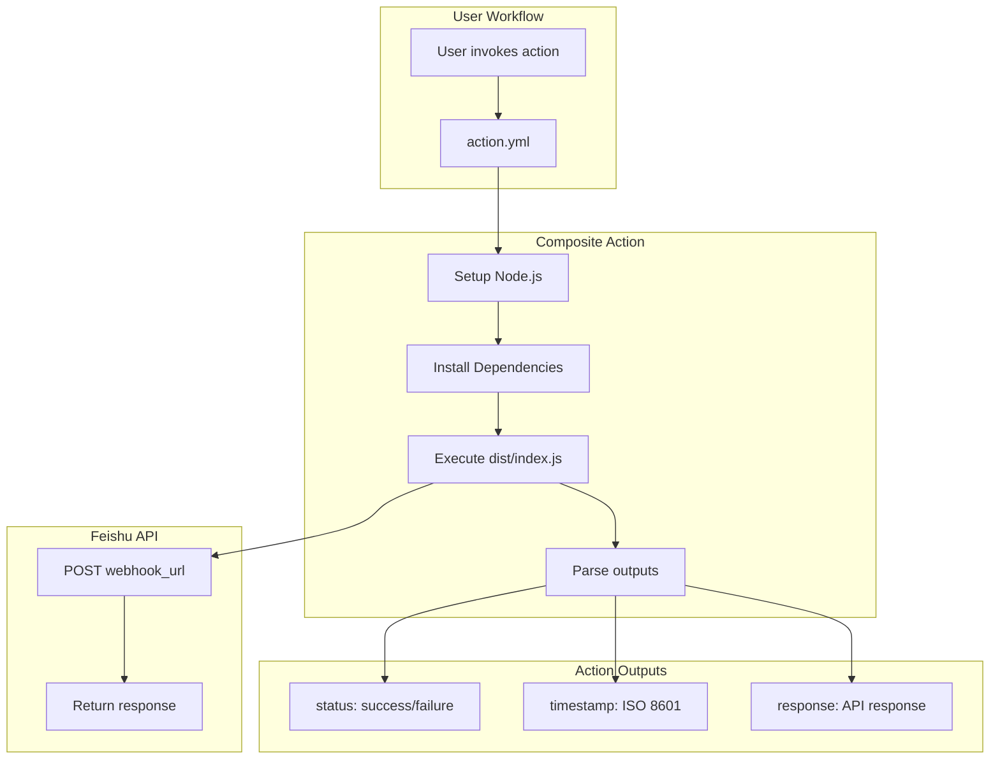
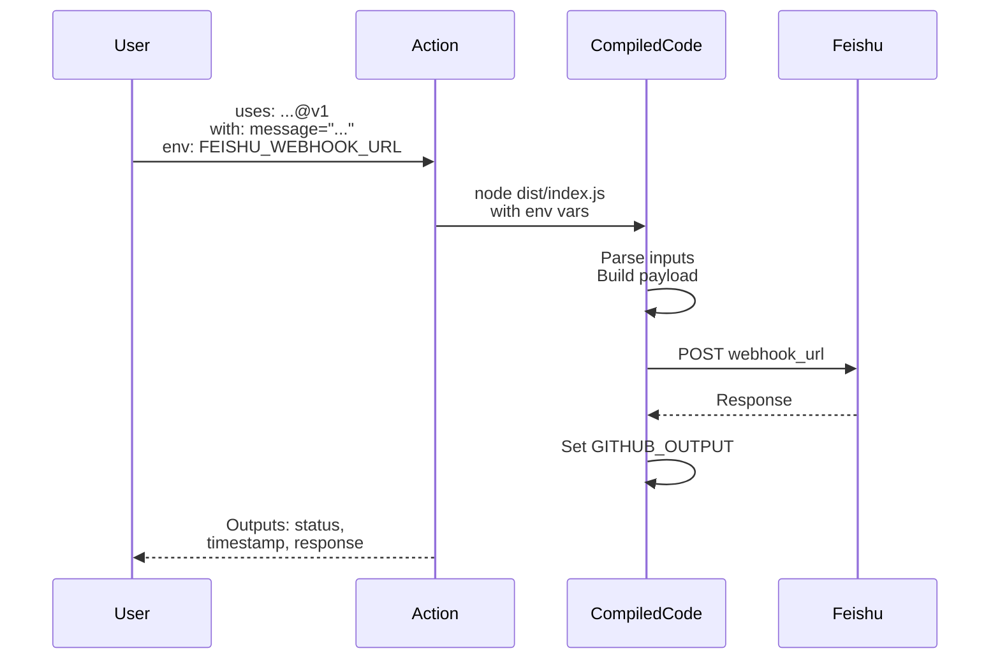
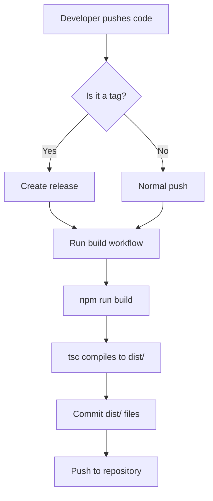

# Design Document: Convert Reusable Workflow to GitHub Action

## Context

The current implementation uses GitHub Actions reusable workflow (`workflow_call` trigger) which requires:
- Full repository checkout during execution
- Runtime installation of tsx for TypeScript execution
- Non-standard invocation syntax (`uses: ./.github/workflows/notify.yml@main`)

This design documents the conversion to a standard GitHub Composite Action for better performance, user experience, and ecosystem alignment.

## Goals / Non-Goals

### Goals
- Eliminate runtime dependencies (tsx) by using pre-compiled JavaScript
- Reduce execution overhead (no full repository checkout needed)
- Align with GitHub Actions ecosystem standards
- Enable proper versioning via Git tags
- Maintain functional parity with current implementation
- Preserve all existing inputs and outputs

### Non-Goals
- Supporting both workflow and action modes simultaneously (choose one pattern)
- Changing the notification API or Feishu integration logic
- Adding new notification providers in this change
- Publishing to npm registry (distribution via GitHub only)

## Decisions

### Decision 1: Use Composite Action Type

**Choice**: Use `runs: using: 'composite'` in `action.yml`

**Rationale**:
- Composite actions allow running multiple steps including shell scripts
- Can leverage existing actions like `actions/setup-node@v4`
- No need to bundle everything into a single executable
- Easier to maintain and debug than JavaScript/TypeScript actions
- Can use npm dependencies directly

**Alternatives considered**:
- **JavaScript action**: Would require bundling all dependencies, more complex build setup
- **Container action**: Overkill for this use case, slower startup time
- **Keep reusable workflow**: Doesn't solve the runtime overhead issues

### Decision 2: Build to dist/ Directory

**Choice**: Compile TypeScript to `dist/index.js` and `dist/*.js` for all source files

**Rationale**:
- Clean separation between source and compiled code
- Can add `dist/` to `.gitignore` for local development
- Build workflow ensures compiled code is committed only on release
- Follows common Node.js package patterns

**Alternatives considered**:
- **Compile to same directory**: Would mix source and compiled files
- **Use different extension**: `.cjs` or `.mjs` adds complexity

### Decision 3: Environment Variable Input for Webhook URL

**Choice**: Pass `FEISHU_WEBHOOK_URL` via `env:` rather than as an action input

**Rationale**:
- Maintains consistency with current implementation
- Better security practice (secrets should be in environment, not inputs)
- Aligns with GitHub Actions patterns for sensitive data

### Decision 4: Breaking Change with Migration Guide

**Choice**: Make this a breaking change and provide clear migration documentation

**Rationale**:
- Simpler implementation (no need to support both modes)
- Cleaner final codebase
- Clearer user experience (one canonical way to use)
- Migration is straightforward (single workflow syntax change)

**Alternatives considered**:
- **Support both concurrently**: Adds maintenance burden, confusion
- **Automatic migration**: Not technically possible, requires user action

## Technical Design

### Architecture



### File Structure Changes

| File Path | Change Type | Reason |
|-----------|-------------|--------|
| `action.yml` | ADD | New action definition (replaces notify.yml) |
| `.github/workflows/notify.yml` | REMOVE | Replaced by composite action |
| `.github/workflows/test-notify.yml` | MODIFY | Update to use new action syntax instead of reusable workflow |
| `dist/index.js` | ADD | Compiled entry point |
| `dist/feishu.js` | ADD | Compiled notification logic |
| `dist/types.js` | ADD | Compiled type definitions (stripped at runtime) |
| `.github/workflows/build.yml` | ADD | CI/CD for automated builds |
| `package.json` | MODIFY | Add build script, prepublishOnly hook |
| `tsconfig.json` | MODIFY | Add outDir configuration |
| `src/action.ts` | ADD | New entry point for action execution (optional) |
| `README.md` | MODIFY | Update usage examples, add migration guide |

### Input/Output Flow



### Build Process



### Build Workflow Definition

```yaml
name: Build

on:
  push:
    branches: [main]
    tags:
      - 'v*'

jobs:
  build:
    runs-on: ubuntu-latest
    steps:
      - uses: actions/checkout@v4
      - uses: actions/setup-node@v4
        with:
          node-version: '20'
      - run: npm ci
      - run: npm run build
      - run: |
          git config user.name github-actions
          git config user.email github-actions@github.com
          git add dist/
          git diff --staged --quiet || git commit -m "Build: compile TypeScript"
          git push
```

### Action Definition Structure

```yaml
name: 'Send Feishu Notification'
description: 'Send notifications to Feishu via webhook'
branding:
  icon: 'send'
  color: 'blue'

inputs:
  message:
    description: 'Notification message content'
    required: true
  msg_type:
    description: 'Message type (text, post, or interactive)'
    required: false
    default: 'text'
  title:
    description: 'Message title for post/interactive messages'
    required: false

outputs:
  status:
    description: 'Notification delivery status'
    value: ${{ steps.run.outputs.status }}
  timestamp:
    description: 'ISO 8601 timestamp'
    value: ${{ steps.run.outputs.timestamp }}
  response:
    description: 'Webhook response or error message'
    value: ${{ steps.run.outputs.response }}

runs:
  using: 'composite'
  steps:
    - name: Setup Node.js
      uses: actions/setup-node@v4
      with:
        node-version: '20'

    - name: Install dependencies
      shell: bash
      run: cd ${{ github.action_path }} && npm ci --production

    - name: Run notification
      id: run
      shell: bash
      env:
        FEISHU_WEBHOOK_URL: ${{ env.FEISHU_WEBHOOK_URL }}
        FEISHU_MESSAGE: ${{ inputs.message }}
        FEISHU_MSG_TYPE: ${{ inputs.msg_type }}
        FEISHU_TITLE: ${{ inputs.title }}
      run: |
        OUTPUT=$(node ${{ github.action_path }}/dist/index.js)
        echo "status=$(echo $OUTPUT | jq -r '.status')" >> $GITHUB_OUTPUT
        echo "timestamp=$(echo $OUTPUT | jq -r '.timestamp')" >> $GITHUB_OUTPUT
        echo "response=$(echo $OUTPUT | jq -r '.response')" >> $GITHUB_OUTPUT
```

## Risks / Trade-offs

### Risk 1: Breaking Change for Existing Users

**Impact**: All users must update their workflow configurations

**Mitigation**:
- Provide clear migration guide in README
- Consider maintaining old workflow with deprecation notice for 1-2 minor versions
- Announce change through repository communications

### Risk 2: Build Complexity

**Impact**: Addition of build step adds complexity to release process

**Mitigation**:
- Use GitHub Actions for automated builds
- Keep build configuration simple (just `tsc`)
- Document build process for contributors

### Risk 3: dist/ File Bloat

**Impact**: Compiled JavaScript files will be in the repository

**Mitigation**:
- Add `dist/` to `.gitignore` for local development
- Only commit dist/ files via automated build workflow
- Keep source code clean and well-organized

### Trade-off: No Runtime TypeScript Compilation

**Benefit**: Faster execution, no tsx dependency

**Cost**: Requires build step before release, adds dist/ files to repo

**Decision**: Benefits outweigh costs for this use case

## Migration Plan

### Phase 1: Implementation (No User Impact)
1. Create `action.yml` alongside existing `notify.yml`
2. Add build configuration
3. Implement compiled execution path
4. Test new action in isolation

### Phase 2: Testing
1. Update `test-notify.yml` workflow to use new action syntax
2. Modify test workflow to use action step instead of reusable workflow call
3. Update show-result job to work with action-level outputs
4. Verify all message types work correctly
5. Test with both organization and repository secrets
6. Validate outputs are properly passed

### Phase 3: Release
1. Create v1.0.0 release tag
2. Update README with new usage examples
3. Add migration guide section
4. Announce to users

### Phase 4: Deprecation (Optional)
1. Add deprecation notice to `notify.yml`
2. Wait 2-3 minor versions for adoption
3. Remove `notify.yml` in v2.0.0

### Rollback Plan

If issues arise after release:
1. Revert `action.yml` changes
2. Users can continue using `notify.yml` with `@<old-tag>` syntax
3. Fix issues in next release cycle

## Open Questions

1. **Should we maintain backward compatibility during transition period?**
   - Recommendation: No, provide clear migration guide instead

2. **Should we publish to npm registry in addition to GitHub?**
   - Recommendation: No, keep GitHub-only distribution for simplicity

3. **Should we add GitHub Actions Toolkit for better output handling?**
   - Recommendation: Not needed for this simple use case, manual parsing is sufficient

4. **What Node.js version should we target?**
   - Recommendation: Node.js 20 (current LTS), matches current workflow configuration

5. **Should we create a separate major version (v2) instead of breaking v1?**
   - Recommendation: Treat v1.0.0 as the first action release, old workflow was "beta"
