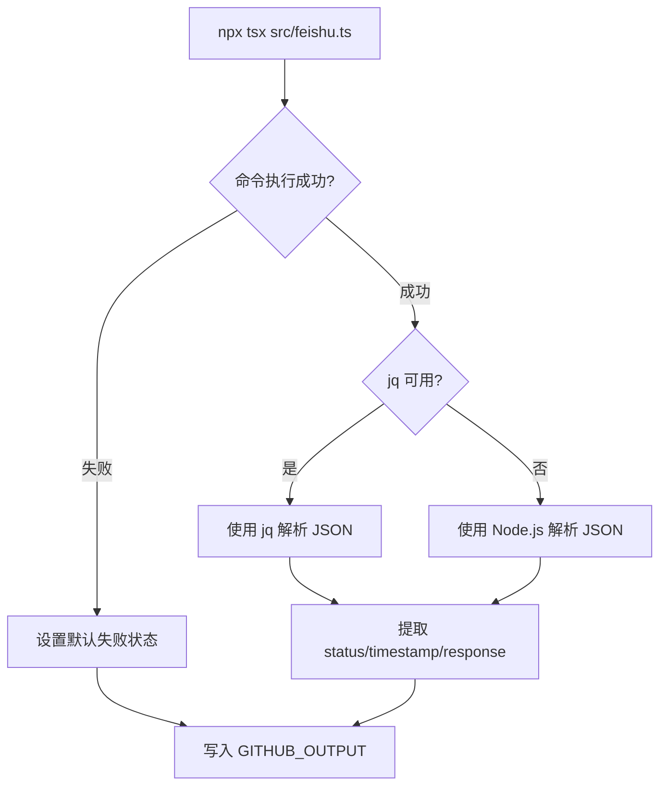
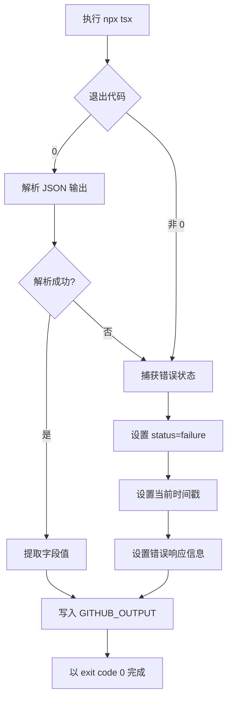

# Change: 修复 GitHub Actions 工作流 JSON 解析错误

## Why

GitHub Actions 工作流执行失败，退出代码为 1。错误发生在 `action.yml` 的 "Run notification" 步骤中。当前使用 `grep -o '"response":"[^"]*"'` 模式来解析 JSON 输出，这种方式在响应中包含换行符、特殊字符或复杂 JSON 结构时会失败，导致工作流异常退出。

根本问题：
1. **bash 脚本 JSON 解析脆弱** - `grep -o` + `cut` 组合无法正确处理包含换行符、引号等特殊字符的响应
2. **错误处理不完整** - 当 CLI 执行失败时，没有优雅的降级处理
3. **HAGI_ACTION_MODE 未生效** - 即使设置了环境变量，工作流仍然以 exit code 1 失败

## What Changes

- **修改 `action.yml`** (第 52-59 行)：使用更健壮的 JSON 解析方法
  - 优先使用 `jq` 进行可靠的 JSON 解析（如果可用）
  - 回退到 Node.js 内置解析（无需外部依赖）
  - 添加 CLI 执行失败时的错误处理
  - 确保所有边界条件都能正确处理

## 代码流程变更

### 数据流图

### 错误处理流程图

### 代码变更清单

| 文件路径 | 变更类型 | 变更原因 | 影响范围 |
|---------|---------|---------|---------|
| `action.yml` | 修改 | 替换脆弱的 grep 解析逻辑为健壮的 jq/Node.js 解析 | GitHub Actions 执行环境 |

### 详细变更 - action.yml

| 行号/区域 | 变更类型 | 变更前 | 变更后 | 变更原因 |
|----------|---------|--------|--------|---------|
| 53-59 | 替换 | 使用 grep -o + cut 模式解析 | 使用 jq 或 Node.js 解析 | 提高解析可靠性 |
| 53 | 新增 | 无 | 添加 CLI 执行错误检查 | 优雅处理执行失败 |
| - | 新增 | 无 | 添加 set +e 防止命令失败立即退出 | 确保后续逻辑执行 |

## Impact

**受影响的代码：**
- `action.yml` - 第 52-59 行的 bash 脚本逻辑

**对外部用户的影响：**
- **无破坏性变更** - action 的输入输出接口保持不变
- **可靠性提升** - 能够正确处理所有 JSON 响应格式
- **错误透明化** - 即使通知失败，action 也能正确完成并返回状态

**预期效果：**
1. bash 脚本能够正确处理所有 JSON 响应格式（包括包含换行符、引号等特殊字符的响应）
2. 即使 CLI 执行失败，action 也能正确完成并设置适当的失败状态
3. 保留 `HAGI_ACTION_MODE` 语义，确保在 GitHub Actions 环境中不以错误代码退出
4. 调试友好 - 保留 JSON 输出用于问题排查

**验证方法：**
1. 运行 `.github/workflows/test-notify.yml` 手动测试工作流
2. 验证以下场景：
   - 正常通知成功
   - Webhook URL 无效/超时
   - 飞书 API 返回错误响应
   - 响应中包含特殊字符（换行、引号等）
3. 检查输出参数 `status`、`timestamp`、`response` 正确设置
4. 确认工作流不会因为通知失败而以 exit code 1 退出

**风险范围：**
- 仅影响 `action.yml` 文件的执行逻辑
- 不影响 TypeScript 源代码的核心功能
- 不破坏现有的 action 接口和用法
- 向后兼容 - 所有现有工作流无需修改即可受益
